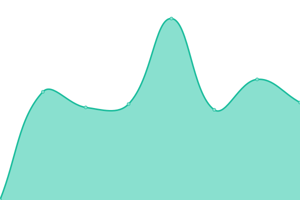
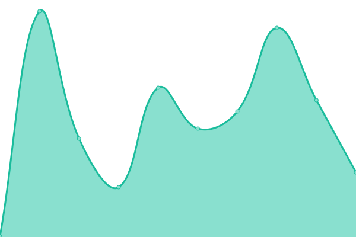
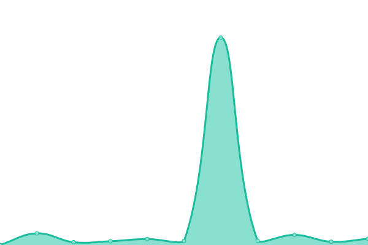

# [📈 Live Status](https://acecentre.github.io/upptime): <!--live status--> **🟩 All systems operational**

This repository contains the open-source uptime monitor and status page for [Ace Centre](http://acecentre.org.uk), powered by [Upptime](https://github.com/upptime/upptime).

With [Upptime](https://upptime.js.org), you can get your own unlimited and free uptime monitor and status page, powered entirely by a GitHub repository. We use [Issues](https://github.com/acecentre/upptime/issues) as incident reports, [Actions](https://github.com/acecentre/upptime/actions) as uptime monitors, and [Pages](https://acecentre.github.io/upptime) for the status page.

<!--start: status pages-->
<!-- This summary is generated by Upptime (https://github.com/upptime/upptime) -->
<!-- Do not edit this manually, your changes will be overwritten -->
<!-- prettier-ignore -->
| URL | Status | History | Response Time | Uptime |
| --- | ------ | ------- | ------------- | ------ |
|  [Main Site](http://acecentre.org.uk/) | 🟩 Up | [main-site.yml](https://github.com/AceCentre/upptime/commits/HEAD/history/main-site.yml) | 

 1847ms
     
 | 

<a href="https://acecentre.github.io/upptime/history/main-site">99.71%</a>
    

|  [Backend](https://backend.acecentre.org.uk/) | 🟩 Up | [backend.yml](https://github.com/AceCentre/upptime/commits/HEAD/history/backend.yml) | 

 3645ms
     
 | 

<a href="https://acecentre.github.io/upptime/history/backend">99.72%</a>
    

|  [Moodle](https://learning.acecentre.org.uk/) | 🟩 Up | [moodle.yml](https://github.com/AceCentre/upptime/commits/HEAD/history/moodle.yml) | 

 3415ms
     
 | 

<a href="https://acecentre.github.io/upptime/history/moodle">99.72%</a>
    

|  [Central](https://central.acecentre.org.uk/) | 🟩 Up | [central.yml](https://github.com/AceCentre/upptime/commits/HEAD/history/central.yml) | 

 618ms
     
 | 

<a href="https://acecentre.github.io/upptime/history/central">99.72%</a>
    

|  [Assistive Technology](https://assistivetechnology.org.uk/) | 🟩 Up | [assistive-technology.yml](https://github.com/AceCentre/upptime/commits/HEAD/history/assistive-technology.yml) | 

 806ms
     
 | 

<a href="https://acecentre.github.io/upptime/history/assistive-technology">100.00%</a>
    

|  [Open Assistive](https://openassistive.org/) | 🟩 Up | [open-assistive.yml](https://github.com/AceCentre/upptime/commits/HEAD/history/open-assistive.yml) | 

 278ms
     
 | 

<a href="https://acecentre.github.io/upptime/history/open-assistive">100.00%</a>
    

|  [Open Assistive - API](https://api.openassistive.org/) | 🟩 Up | [open-assistive-api.yml](https://github.com/AceCentre/upptime/commits/HEAD/history/open-assistive-api.yml) | 

 421ms
     
 | 

<a href="https://acecentre.github.io/upptime/history/open-assistive-api">100.00%</a>
    

|  [SpeechBubble](https://speechbubble.org.uk/) | 🟩 Up | [speech-bubble.yml](https://github.com/AceCentre/upptime/commits/HEAD/history/speech-bubble.yml) | 

 415ms
     
 | 

<a href="https://acecentre.github.io/upptime/history/speech-bubble">100.00%</a>
    

|  [Dasher](https://dasher.acecentre.net) | 🟩 Up | [dasher.yml](https://github.com/AceCentre/upptime/commits/HEAD/history/dasher.yml) | 

 174ms
     
 | 

<a href="https://acecentre.github.io/upptime/history/dasher">100.00%</a>
    

<!--end: status pages-->

[**Visit our status website →**](https://acecentre.github.io/upptime)

## 📄 License

- Powered by: [Upptime](https://github.com/upptime/upptime)
- Code: [MIT](./LICENSE) © [Ace Centre](http://acecentre.org.uk)
- Data in the `./history` directory: [Open Database License](https://opendatacommons.org/licenses/odbl/1-0/)
